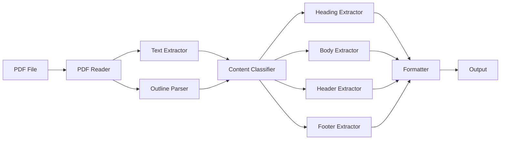

# PDF Parser Refactor - 设计文档

## Overview

PDF Parser Refactor 是对现有 PDF 标题解析工具的重构和功能扩展项目。该工具使用 Golang 开发，基于 unidoc/unipdf/v3 库，旨在从 PDF 文档中提取结构化内容，包括标题、正文、页眉和页脚。

### 当前功能

现有工具已实现：
- 从 PDF 大纲（目录/书签）提取标题
- 从文本内容识别标题格式（支持 "1. ", "1.1 ", "2.3.4." 等格式）
- 标题合并和去重
- 基本的命令行接口（支持 -d/--debug, -h/--help）
- 层级化的标题输出

### 新增功能

本次重构将添加：
- 正文内容提取（排除标题、页眉、页脚）
- 页眉识别和提取（基于位置和重复性）
- 页脚识别和提取（包括页码识别）
- 内容分类算法（区分标题、正文、页眉、页脚）
- 增强的命令行接口（--extract-all, --extract-body, --extract-header, --extract-footer, --format json）
- JSON 格式输出支持
- 性能优化（strings.Builder, 内置 min 函数, strings.SplitSeq）

### 设计目标

1. 保持向后兼容性：现有功能和接口不变
2. 模块化设计：清晰的职责分离
3. 高性能：优化字符串操作和内存使用
4. 可扩展性：易于添加新的内容类型和输出格式
5. 健壮性：完善的错误处理和容错机制

## Architecture

### 系统架构

系统采用分层架构，从底层到上层依次为：

```
┌─────────────────────────────────────────┐
│           CLI Layer (main)              │
│  - 参数解析                              │
│  - 输出格式化                            │
└─────────────────────────────────────────┘
                    ↓
┌─────────────────────────────────────────┐
│      Content Extraction Layer           │
│  - extractHeadings()                    │
│  - extractBody()                        │
│  - extractHeaders()                     │
│  - extractFooters()                     │
└─────────────────────────────────────────┘
                    ↓
┌─────────────────────────────────────────┐
│     Content Classification Layer        │
│  - ContentClassifier                    │
│  - 位置分析                              │
│  - 重复性检测                            │
└─────────────────────────────────────────┘
                    ↓
┌─────────────────────────────────────────┐
│         PDF Processing Layer            │
│  - unidoc/unipdf/v3                     │
│  - 文本提取                              │
│  - 大纲解析                              │
└─────────────────────────────────────────┘
```

### 核心模块

#### 1. PDF Reader Module
负责与 unipdf 库交互，提供统一的 PDF 访问接口。

#### 2. Content Extraction Module
包含各类内容提取函数：
- extractHeadings: 标题提取（已有，需优化）
- extractBody: 正文提取（新增）
- extractHeaders: 页眉提取（新增）
- extractFooters: 页脚提取（新增）

#### 3. Content Classification Module
实现内容分类算法，根据位置、重复性、格式等特征区分内容类型。

#### 4. Formatting Module
负责输出格式化：
- 文本格式输出（已有，需增强）
- JSON 格式输出（新增）

#### 5. CLI Module
命令行接口，参数解析和用户交互。

### 数据流



## Components and Interfaces

### 1. Core Data Structures

#### Heading (已有)
```go
type Heading struct {
    Title string
    Level int
    Page  int64
}
```

#### BodyText (新增)
```go
type BodyText struct {
    Content string  // 正文内容
    Page    int64   // 所在页码
}
```

#### HeaderFooter (新增)
```go
type HeaderFooter struct {
    Content   string  // 页眉/页脚内容
    PageRange []int64 // 出现的页码范围
    Type      string  // "header" 或 "footer"
}
```

#### TextBlock (新增 - 内部使用)
```go
type TextBlock struct {
    Content  string
    Page     int64
    YPos     float64  // Y 坐标（用于位置判断）
    Height   float64  // 页面高度
}
```

#### PDFContent (新增 - 统一输出结构)
```go
type PDFContent struct {
    Headings []Heading
    Body     []BodyText
    Headers  []HeaderFooter
    Footers  []HeaderFooter
}
```

### 2. Content Classifier

#### ContentClassifier Interface
```go
type ContentClassifier struct {
    HeaderThreshold float64  // 页眉区域阈值（默认 0.15，即页面顶部 15%）
    FooterThreshold float64  // 页脚区域阈值（默认 0.15，即页面底部 15%）
}

func (c *ContentClassifier) ClassifyTextBlock(block TextBlock) string
func (c *ContentClassifier) DetectRepeatingPatterns(blocks []TextBlock) map[string][]int64
```

ClassifyTextBlock 返回值：
- "header": 页眉
- "footer": 页脚
- "heading": 标题
- "body": 正文

### 3. Extraction Functions

#### extractBody
```go
func extractBody(pdfReader *model.PdfReader, classifier *ContentClassifier) ([]BodyText, error)
```
从 PDF 中提取正文内容，排除标题、页眉、页脚。

#### extractHeaders
```go
func extractHeaders(pdfReader *model.PdfReader, classifier *ContentClassifier) ([]HeaderFooter, error)
```
识别和提取页眉，基于位置和重复性。

#### extractFooters
```go
func extractFooters(pdfReader *model.PdfReader, classifier *ContentClassifier) ([]HeaderFooter, error)
```
识别和提取页脚，包括页码识别。

#### extractAllContent
```go
func extractAllContent(pdfPath string) (*PDFContent, error)
```
提取所有类型的内容，返回统一的 PDFContent 结构。

### 4. Formatting Functions

#### formatAsText
```go
func formatAsText(content *PDFContent, options FormatOptions) string
```
将内容格式化为文本输出。

#### formatAsJSON
```go
func formatAsJSON(content *PDFContent) (string, error)
```
将内容格式化为 JSON 输出。

#### FormatOptions
```go
type FormatOptions struct {
    ShowHeadings bool
    ShowBody     bool
    ShowHeaders  bool
    ShowFooters  bool
}
```

### 5. CLI Interface

命令行参数：
- `<PDF文件路径>`: 必需参数
- `-d, --debug`: 调试模式
- `-h, --help`: 帮助信息
- `--extract-all`: 提取所有内容（默认）
- `--extract-body`: 仅提取正文
- `--extract-header`: 仅提取页眉
- `--extract-footer`: 仅提取页脚
- `--format json`: JSON 格式输出（默认为文本格式）

## Data Models

### 内容分类模型

#### 位置模型
基于 Y 坐标判断内容位置：
- 页眉区域：`YPos / Height > (1 - HeaderThreshold)`
- 页脚区域：`YPos / Height < FooterThreshold`
- 正文区域：介于页眉和页脚之间

#### 重复性检测模型
用于识别页眉和页脚：
1. 收集所有页面的文本块
2. 按内容分组
3. 统计每个内容出现的页码
4. 如果内容在 3 个或以上页面重复出现，且位置一致，则判定为页眉或页脚

#### 标题识别模型
保持现有逻辑：
1. 从大纲提取（优先级高）
2. 从文本内容匹配正则表达式：
   - `^(\d+)\.\s+(.+)$`: 匹配 "1. ", "7. "
   - `^(\d+\.\d+(?:\.\d+)*)\s+(.+)$`: 匹配 "1.1 ", "2.3.4 "
   - `^(\d+\.\d+(?:\.\d+)*)\.\s+(.+)$`: 匹配 "1.1.", "2.3.4."
3. 级别计算：点号数量 + 1

### 数据处理流程

#### 标题提取流程（优化后）
```
1. 打开 PDF 文件
2. 提取大纲标题
3. 逐页提取文本
4. 使用正则表达式匹配标题
5. 合并和去重
6. 返回标题列表
```

#### 正文提取流程
```
1. 逐页提取文本块（带位置信息）
2. 使用 ContentClassifier 分类每个文本块
3. 筛选出分类为 "body" 的文本块
4. 按页码组织正文内容
5. 返回正文列表
```

#### 页眉/页脚提取流程
```
1. 逐页提取文本块（带位置信息）
2. 筛选出位于页眉/页脚区域的文本块
3. 检测重复模式
4. 识别页码模式（对于页脚）
5. 合并相同的页眉/页脚，记录页码范围
6. 返回页眉/页脚列表
```

### 性能优化策略

#### 1. 字符串操作优化
- 使用 `strings.Builder` 替代 `+=` 拼接
- 使用 `strings.SplitSeq` (Go 1.24+) 替代 `strings.Split`

#### 2. 内置函数使用
- 使用内置 `min` 函数（Go 1.24+）替代自定义实现

#### 3. 内存优化
- 预分配切片容量
- 及时释放大对象引用

#### 4. 并发处理（可选，未来扩展）
- 页面级别的并发提取
- 使用 worker pool 模式

### 错误处理策略

#### 错误类型
1. 文件访问错误：无法打开文件
2. PDF 格式错误：文件不是有效的 PDF
3. 页面提取错误：单页提取失败
4. 文本提取错误：无法提取文本内容

#### 错误处理原则
1. 使用 `fmt.Errorf` 和 `%w` 包装错误，保留错误链
2. 部分失败时继续执行，返回已提取的结果
3. 在 CLI 层使用 `log.Fatalf` 处理致命错误
4. 提供清晰的错误消息，包含上下文信息

#### 容错机制
- 大纲提取失败时，继续尝试文本提取
- 单页提取失败时，记录错误但继续处理其他页面
- 分类不确定时，默认归类为正文


## Correctness Properties

属性（Property）是一个特征或行为，应该在系统的所有有效执行中保持为真——本质上是关于系统应该做什么的形式化陈述。属性是人类可读规范和机器可验证正确性保证之间的桥梁。

### Property 1: 大纲标题提取完整性

*对于任何*包含大纲的 PDF 文件，提取的标题列表应包含大纲中的所有项目，且每个标题都包含标题文字、层级和页码信息。

**Validates: Requirements 1.1, 1.2**

### Property 2: 大纲嵌套结构保持

*对于任何*包含嵌套大纲的 PDF 文件，子项的标题级别应该等于其父项的级别加 1，且所有嵌套层级都应被提取。

**Validates: Requirements 1.3, 1.4**

### Property 3: 标题格式识别完整性

*对于任何*符合支持格式（"数字. ", "数字.数字 ", "数字.数字."）的文本行，应该被识别为标题，且级别应等于点号数量加 1。

**Validates: Requirements 2.1, 2.2, 2.3, 2.4**

### Property 4: 页面扫描完整性

*对于任何*PDF 文档，文本提取应扫描所有页面，且提取的标题应覆盖文档的所有页面（如果这些页面包含标题）。

**Validates: Requirements 2.6**

### Property 5: 空行过滤

*对于任何*提取的标题列表，不应包含空标题或仅包含空白字符的标题。

**Validates: Requirements 2.7**

### Property 6: 大纲标题优先级

*对于任何*同时存在于大纲和文本中的标题，合并后的结果应保留大纲版本的标题。

**Validates: Requirements 3.1**

### Property 7: 标题去重正确性

*对于任何*标题列表，如果两个标题在同一页且标题开头相似（前 10 个字符），则合并后的结果中应只保留一个副本。

**Validates: Requirements 3.3, 3.4, 3.5**

### Property 8: 文本标题添加

*对于任何*从文本中提取的标题，如果它不与大纲标题重复，则应被添加到最终结果列表中。

**Validates: Requirements 3.2**

### Property 9: 错误路径处理

*对于任何*无效的文件路径，Parser 应返回包含该文件路径的错误消息。

**Validates: Requirements 4.10, 7.1**

### Property 10: 标题输出格式正确性

*对于任何*标题，其格式化输出应包含级别、标题文字和页码，且缩进应等于 (级别 - 1) × 2 个空格。

**Validates: Requirements 5.2, 5.3**

### Property 11: 输出顺序保持

*对于任何*标题列表，格式化输出的顺序应与输入列表的顺序一致。

**Validates: Requirements 5.4**

### Property 12: 标题计数显示

*对于任何*标题列表，格式化输出应包含标题总数的显示。

**Validates: Requirements 5.1**

### Property 13: 部分失败容错

*对于任何*PDF 文档，即使部分页面提取失败，Parser 应继续处理其他页面并返回已成功提取的结果。

**Validates: Requirements 6.5, 7.5**

### Property 14: 向后兼容性 - 参数支持

*对于任何*现有的命令行参数（-d, --debug, -h, --help），重构后的工具应保持相同的行为。

**Validates: Requirements 10.1**

### Property 15: 向后兼容性 - 输出格式

*对于任何*相同的 PDF 文件，重构前后的工具应产生相同格式的输出（对于相同的参数）。

**Validates: Requirements 10.2**

### Property 16: 向后兼容性 - 提取结果

*对于任何*相同的 PDF 文件，重构前后的工具应提取相同的标题列表（内容和顺序）。

**Validates: Requirements 10.4**

### Property 17: 向后兼容性 - 错误处理

*对于任何*导致错误的输入，重构前后的工具应产生相同的错误处理行为。

**Validates: Requirements 10.5**

### Property 18: 正文提取完整性

*对于任何*PDF 页面，正文提取应尝试从每个页面提取内容，且每段正文都应记录所在页码。

**Validates: Requirements 11.1, 11.4**

### Property 19: 正文内容排他性

*对于任何*提取的正文内容，不应包含被识别为标题、页眉或页脚的文本。

**Validates: Requirements 11.2**

### Property 20: 正文格式保持

*对于任何*正文内容，段落结构和换行应被保留。

**Validates: Requirements 11.3**

### Property 21: 正文顺序性

*对于任何*正文列表，内容应按页码顺序组织。

**Validates: Requirements 11.5**

### Property 22: 跨页正文连接

*对于任何*跨越多页的正文内容，应正确连接而不丢失内容。

**Validates: Requirements 11.6**

### Property 23: 页眉识别准确性

*对于任何*被识别为页眉的文本，应满足：(1) 位于页面顶部区域（Y 坐标 / 页面高度 > 0.85），(2) 在至少 3 个页面重复出现。

**Validates: Requirements 12.1, 12.2, 12.3**

### Property 24: 页眉数据完整性

*对于任何*提取的页眉，应包含文本内容和出现的页码范围。

**Validates: Requirements 12.4**

### Property 25: 页眉变化识别

*对于任何*两个内容不同的页眉，应被识别为不同的页眉项。

**Validates: Requirements 12.5**

### Property 26: 奇偶页页眉页脚独立识别

*对于任何*在奇数页和偶数页有不同内容的页眉或页脚，应被识别为两个独立的页眉/页脚项。

**Validates: Requirements 12.6, 13.7**

### Property 27: 页脚识别准确性

*对于任何*被识别为页脚的文本，应满足：(1) 位于页面底部区域（Y 坐标 / 页面高度 < 0.15），(2) 在至少 3 个页面重复出现或符合页码模式。

**Validates: Requirements 13.1, 13.2, 13.3**

### Property 28: 页脚数据完整性

*对于任何*提取的页脚，应包含文本内容和出现的页码范围。

**Validates: Requirements 13.5**

### Property 29: 页码识别

*对于任何*页脚中的递增数字序列，应被识别为页码信息。

**Validates: Requirements 13.4**

### Property 30: 页脚模式识别

*对于任何*在不同页面有变化但符合模式（如页码递增）的页脚，应被识别为同一页脚模式。

**Validates: Requirements 13.6**

### Property 31: 内容分类互斥性

*对于任何*文本块，应被分类为且仅被分类为以下类型之一：标题、正文、页眉或页脚。

**Validates: Requirements 15 (正确性属性 1)**

### Property 32: 内容分类完整性

*对于任何*从 PDF 提取的文本块，都应被分类到某一内容类型。

**Validates: Requirements 15 (正确性属性 2)**

### Property 33: 位置主导分类

*对于任何*文本块，其分类应主要基于其 Y 坐标位置：顶部 15% 为页眉区域，底部 15% 为页脚区域，中间为正文/标题区域。

**Validates: Requirements 15.1**

### Property 34: 重复性辅助判断

*对于任何*在多个页面重复出现的文本块，如果位于页眉或页脚区域，应更倾向于被分类为页眉或页脚。

**Validates: Requirements 15.2**

### Property 35: 不确定时默认正文

*对于任何*分类不确定的文本块，应被归类为正文。

**Validates: Requirements 15.6**

### Property 36: 输出分区清晰性

*对于任何*包含多种内容类型的输出，应包含明确的分区标记（如 "=== 标题 ===", "=== 正文 ==="）。

**Validates: Requirements 14.5**

### Property 37: 统计信息显示

*对于任何*内容类型，输出应包含该类型的统计信息（如数量、页码范围）。

**Validates: Requirements 14.6**

### Property 38: JSON 输出有效性

*对于任何*使用 --format json 参数的输出，应是有效的 JSON 格式且可以被解析。

**Validates: Requirements 4.8, 14.7**

## Error Handling

### 错误分类

#### 1. 文件访问错误
- 文件不存在
- 文件无读取权限
- 文件路径无效

处理策略：立即返回错误，包含文件路径信息，使用 `fmt.Errorf("无法打开文件 %s: %w", path, err)`

#### 2. PDF 格式错误
- 文件不是有效的 PDF
- PDF 损坏或不完整
- 不支持的 PDF 版本

处理策略：返回描述性错误，使用 `fmt.Errorf("无法读取 PDF: %w", err)`

#### 3. 内容提取错误
- 单页提取失败
- 文本提取失败
- 大纲解析失败

处理策略：记录错误但继续处理，返回部分结果

#### 4. 参数错误
- 缺少必需参数
- 参数值无效
- 参数组合冲突

处理策略：显示使用说明，以非零状态码退出

### 错误处理原则

1. **错误链保留**: 使用 `%w` 包装底层错误，保留完整的错误上下文
2. **部分成功**: 在可能的情况下返回部分结果而不是完全失败
3. **清晰消息**: 错误消息应包含足够的上下文信息帮助用户定位问题
4. **优雅降级**: 大纲提取失败时尝试文本提取，单页失败时继续处理其他页面

### 错误处理示例

```go
// 文件访问错误
f, err := os.Open(pdfPath)
if err != nil {
    return nil, fmt.Errorf("无法打开文件 %s: %w", pdfPath, err)
}

// PDF 格式错误
pdfReader, err := model.NewPdfReader(f)
if err != nil {
    return nil, fmt.Errorf("无法读取 PDF: %w", err)
}

// 部分失败容错
for pageNum := 1; pageNum <= numPages; pageNum++ {
    page, err := pdfReader.GetPage(pageNum)
    if err != nil {
        // 记录错误但继续处理
        log.Printf("警告: 无法读取第 %d 页: %v", pageNum, err)
        continue
    }
    // 处理页面...
}

// CLI 层致命错误
if err != nil {
    log.Fatalf("错误: %v", err)
}
```

### 边界情况处理

1. **空 PDF**: 返回空结果列表，不报错
2. **无大纲 PDF**: 尝试文本提取
3. **无文本 PDF**: 返回大纲结果（如果有）
4. **混合语言**: 正常处理，不做特殊处理
5. **特殊字符**: 保持原样输出
6. **超大文件**: 逐页处理，避免一次性加载所有内容到内存

## Testing Strategy

### 测试方法论

本项目采用双重测试策略，结合单元测试和基于属性的测试（Property-Based Testing, PBT），以确保全面的测试覆盖和软件正确性。

#### 单元测试（Unit Tests）
用于验证：
- 特定的示例场景
- 边界情况和边缘条件
- 错误处理路径
- 集成点和接口

#### 基于属性的测试（Property-Based Tests）
用于验证：
- 通用属性在所有输入下都成立
- 通过随机生成大量测试用例发现边缘情况
- 设计文档中定义的正确性属性

两种测试方法是互补的：单元测试捕获具体的错误，属性测试验证通用的正确性。

### 属性测试配置

#### 测试库选择
使用 Go 语言的属性测试库：
- **gopter** (推荐): 功能完整的 PBT 库，支持自定义生成器
- 备选: **rapid** 或 **go-fuzz**

#### 测试配置
- 每个属性测试最少运行 100 次迭代
- 使用固定的随机种子以确保可重现性
- 失败时自动缩小（shrinking）到最小失败案例

#### 标签格式
每个属性测试必须包含注释，引用设计文档中的属性：

```go
// Feature: pdf-parser-refactor, Property 1: 大纲标题提取完整性
func TestProperty_OutlineExtractionCompleteness(t *testing.T) {
    // 属性测试实现
}
```

### 测试覆盖范围

#### 1. 标题提取测试

**单元测试**:
- 测试已知 PDF 文件的标题提取（如 135_title.pdf）
- 测试各种标题格式的识别
- 测试空 PDF 和无标题 PDF
- 测试大纲和文本提取的集成

**属性测试**:
- Property 1: 大纲标题提取完整性
- Property 2: 大纲嵌套结构保持
- Property 3: 标题格式识别完整性
- Property 4: 页面扫描完整性
- Property 5: 空行过滤

#### 2. 标题合并测试

**单元测试**:
- 测试重复标题的去重
- 测试大纲和文本标题的合并
- 测试边界情况（相似但不完全相同的标题）

**属性测试**:
- Property 6: 大纲标题优先级
- Property 7: 标题去重正确性
- Property 8: 文本标题添加

#### 3. 正文提取测试

**单元测试**:
- 测试简单文档的正文提取
- 测试多栏布局文档
- 测试跨页正文
- 测试混合内容文档

**属性测试**:
- Property 18: 正文提取完整性
- Property 19: 正文内容排他性
- Property 20: 正文格式保持
- Property 21: 正文顺序性
- Property 22: 跨页正文连接

#### 4. 页眉页脚提取测试

**单元测试**:
- 测试标准页眉页脚文档
- 测试奇偶页不同的页眉页脚
- 测试无页眉页脚文档
- 测试页码识别

**属性测试**:
- Property 23: 页眉识别准确性
- Property 24: 页眉数据完整性
- Property 25: 页眉变化识别
- Property 26: 奇偶页页眉页脚独立识别
- Property 27: 页脚识别准确性
- Property 28: 页脚数据完整性
- Property 29: 页码识别
- Property 30: 页脚模式识别

#### 5. 内容分类测试

**单元测试**:
- 测试位置阈值配置
- 测试边界情况（标题位于页眉区域）
- 测试分类器的各个判断条件

**属性测试**:
- Property 31: 内容分类互斥性
- Property 32: 内容分类完整性
- Property 33: 位置主导分类
- Property 34: 重复性辅助判断
- Property 35: 不确定时默认正文

#### 6. 格式化输出测试

**单元测试**:
- 测试文本格式输出
- 测试 JSON 格式输出
- 测试空结果输出
- 测试各种提取选项的输出

**属性测试**:
- Property 10: 标题输出格式正确性
- Property 11: 输出顺序保持
- Property 12: 标题计数显示
- Property 36: 输出分区清晰性
- Property 37: 统计信息显示
- Property 38: JSON 输出有效性

#### 7. 错误处理测试

**单元测试**:
- 测试无效文件路径
- 测试损坏的 PDF 文件
- 测试无效参数组合
- 测试部分失败场景

**属性测试**:
- Property 9: 错误路径处理
- Property 13: 部分失败容错

#### 8. 向后兼容性测试

**单元测试**:
- 对比新旧版本的输出
- 测试所有现有参数
- 测试现有测试用例的通过情况

**属性测试**:
- Property 14: 向后兼容性 - 参数支持
- Property 15: 向后兼容性 - 输出格式
- Property 16: 向后兼容性 - 提取结果
- Property 17: 向后兼容性 - 错误处理

#### 9. CLI 接口测试

**单元测试**:
- 测试所有命令行参数
- 测试帮助信息显示
- 测试调试模式
- 测试各种提取选项
- 测试输出格式选项

### 性能测试

#### 基准测试
保留并扩展现有的基准测试：

```go
func BenchmarkExtractHeadings(b *testing.B) {
    // 现有基准测试
}

func BenchmarkExtractBody(b *testing.B) {
    // 新增：正文提取基准测试
}

func BenchmarkExtractAllContent(b *testing.B) {
    // 新增：完整内容提取基准测试
}
```

#### 性能目标
- 标题提取性能不应低于重构前
- 完整内容提取（标题+正文+页眉+页脚）应在合理时间内完成（< 5 秒 for 100 页文档）
- 内存使用应保持稳定，不随文档大小线性增长

### 测试数据

#### 测试 PDF 文件
- **135_title.pdf**: 现有测试文件，包含复杂的标题结构
- **simple.pdf**: 简单文档，用于基本功能测试
- **no_outline.pdf**: 无大纲文档，测试文本提取
- **multi_column.pdf**: 多栏布局文档
- **header_footer.pdf**: 包含页眉页脚的文档
- **odd_even_pages.pdf**: 奇偶页不同页眉页脚的文档
- **empty.pdf**: 空文档
- **corrupted.pdf**: 损坏的 PDF 文件（用于错误处理测试）

### 持续集成

测试应在以下情况下自动运行：
- 每次代码提交
- Pull Request 创建和更新
- 定期调度（每日）

CI 配置应包括：
- 运行所有单元测试
- 运行所有属性测试（100+ 迭代）
- 运行基准测试并比较性能
- 检查测试覆盖率（目标 > 80%）
- 运行静态分析工具（golint, go vet）

### 测试维护

- 重构时必须保持所有现有测试通过
- 添加新功能时必须添加相应的测试
- 修复 bug 时应添加回归测试
- 定期审查和更新测试用例
- 保持测试代码的可读性和可维护性
